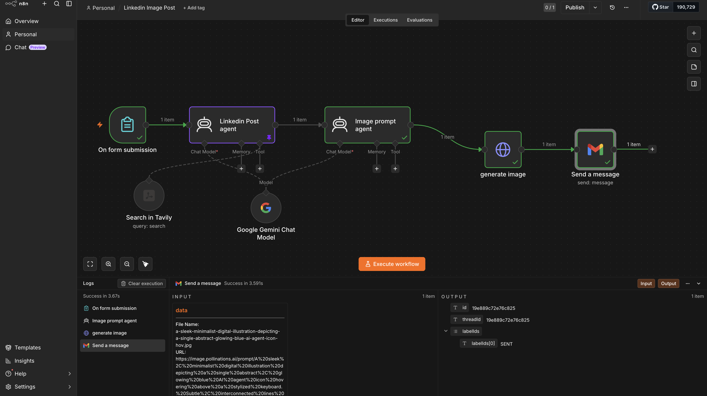
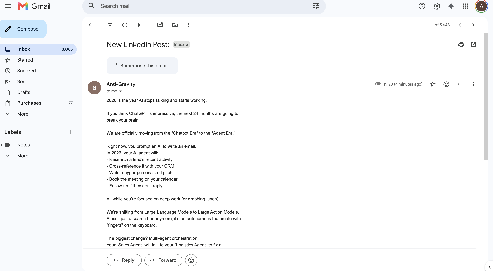
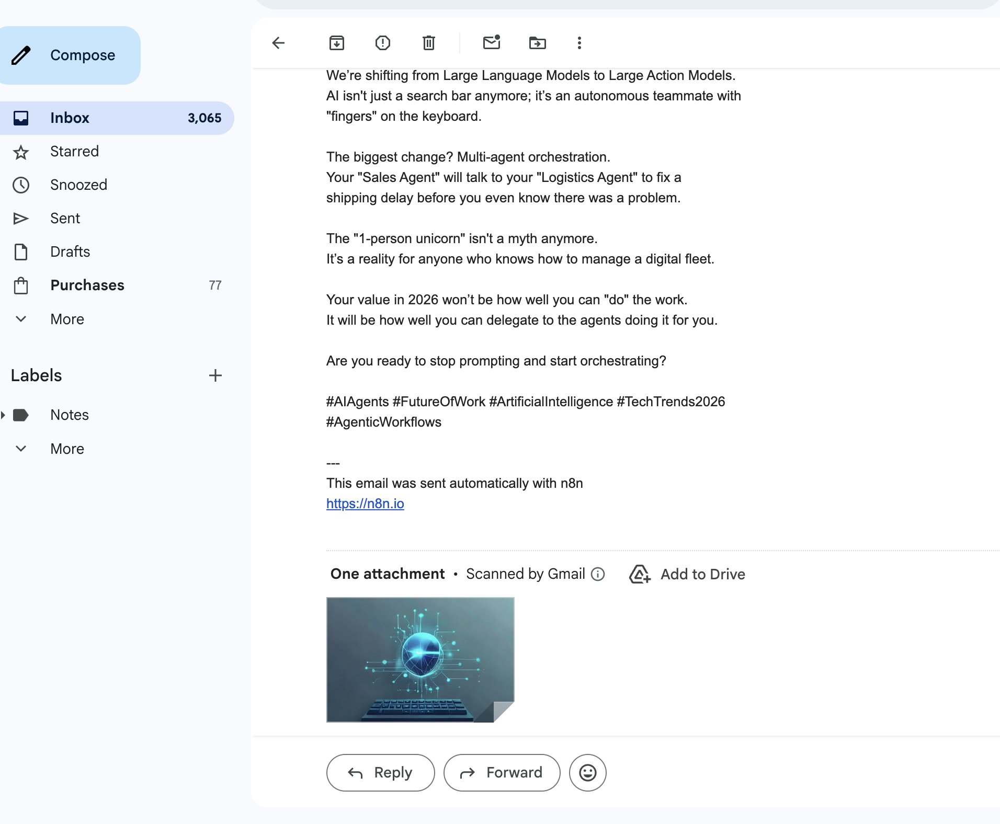

# LinkedIn Image Post

An n8n content-automation workflow that takes a single topic from a form, researches it live with Tavily, writes a ready-to-publish LinkedIn post with Google Gemini, generates a matching image, and delivers the post and image to Gmail for review.

The output is intentionally sent to Gmail rather than published directly to LinkedIn, so every generated post can be reviewed and approved by a human before it goes public. The same workflow pattern can be repointed at a LinkedIn, X, or scheduling API once the drafts are trusted.

## Preview

### AI-generated image



### Generated LinkedIn post in Gmail



### Post body, hashtags, and attached image



## What this workflow does

1. **Accepts a topic** from a submitted n8n form.
2. **Researches the topic live** with the Tavily search tool.
3. **Writes a LinkedIn post** with Google Gemini, grounded in the research.
4. **Writes an image prompt** from the finished post with a second Gemini agent.
5. **Generates an image** from that prompt.
6. **Delivers the post and image to Gmail** as the email body plus an attachment.

```text
On form submission -> LinkedIn Post agent -> Image prompt agent -> generate image -> Gmail
```

## Deliverables

- [`workflow/linkedin-image-post.json`](workflow/linkedin-image-post.json) - sanitized n8n export.
- [`docs/architecture.md`](docs/architecture.md) - node-by-node architecture and data flow.
- [`docs/workflow.md`](docs/workflow.md) - build notes, setup checklist, debugging notes, and quota notes.
- [`CHANGELOG.md`](CHANGELOG.md) - iteration log and known limitations.
- [`docs/assets/`](docs/assets/) - workflow output screenshots.

## Why this stack

- **n8n** - visual automation builder where every node can be tested independently.
- **n8n Form Trigger** - simple topic input that starts the run.
- **Tavily Search tool** - gives the writing agent live, current research instead of stale model knowledge.
- **Google Gemini Chat Model** - used for both the post-writing agent and the image-prompt agent.
- **HTTP Request image generation** - turns the image prompt into an actual picture.
- **Gmail (Send)** - delivers the post and image to a human inbox for review.

## Why we use two different model roles

This workflow deliberately separates the **text** model from the **image** generation step, because they are not the same capability and they are not priced the same way.

- The **post agent** and the **image-prompt agent** run on a Gemini **text** model (`gemini-2.5-flash-lite`). Text generation is available on the Gemini free tier, so writing the post and the image prompt costs nothing.
- **Image generation is a separate, paid capability.** Gemini's image models (for example `gemini-2.5-flash-image-preview`) are not available on the free tier; calling them returns `429 ... limit: 0`, which is a billing wall, not a temporary rate limit. To keep the entire workflow free, image generation is handled by a free image endpoint via an HTTP Request node instead of a billed Gemini image model.

The result: a fully working post-plus-image pipeline that runs at zero cost, with a clear, documented upgrade path to a billed Gemini image model when higher image quality is required.

## Why the output goes to Gmail instead of LinkedIn

The original reference pattern publishes straight to LinkedIn. This build intentionally ends in **Gmail** for three reasons:

1. **Human review before publishing.** AI-written posts should be approved by a person before they are public. Delivering to an inbox creates a natural review-and-edit step.
2. **No publishing risk during development.** Testing a LinkedIn-publishing node repeatedly can post unfinished drafts to a real public profile. Email output is safe to run as many times as needed.
3. **Lower setup friction.** Gmail is a single OAuth connection that most people already have, whereas the LinkedIn posting API requires app registration and review. Gmail lets the workflow be demonstrated end to end immediately.

Swapping Gmail for a LinkedIn node (or a scheduler) at the end is a one-node change once the drafts are trusted.

## Product coverage

- Form-driven topic input.
- Live web research via Tavily before writing.
- Gemini-written LinkedIn post with hook, body, and hashtags.
- Automatically generated image prompt derived from the post.
- Image generation through an HTTP Request node.
- Post delivered as the email body with the image attached.
- Debuggable n8n node chain with visible execution outputs.
- Sanitized workflow export that can be imported into another n8n instance.

## How this was built

The workflow was built and debugged node by node in the n8n editor. Each step was verified before connecting the next one:

1. The Form Trigger captured a real `Topic` submission.
2. The LinkedIn Post agent researched the topic with Tavily and wrote the post.
3. The Image prompt agent turned the post into a single image-generation prompt.
4. The HTTP Request node generated the image and returned it as a file.
5. The Gmail node delivered the post body with the image attached.

This node-by-node approach made the main failures easier to isolate: model selection, free-tier quota walls, leftover request configuration, and binary-file handling.

## Architecture

```text
                +-----------------------------+
                |      On form submission     |
                |        Topic field          |
                +--------------+--------------+
                               |
                               v
                +-----------------------------+
                |       LinkedIn Post agent   |---- Gemini Chat Model (text)
                |        Tools Agent          |---- Tavily Search (tool)
                +--------------+--------------+
                               |
                               v
                +-----------------------------+
                |       Image prompt agent    |---- Gemini Chat Model (text)
                |        Tools Agent          |
                +--------------+--------------+
                               |
                               v
                +-----------------------------+
                |        generate image       |
                |   HTTP Request -> file      |
                +--------------+--------------+
                               |
                               v
                +-----------------------------+
                |        Send a message       |
                |     Gmail (post + image)    |
                +-----------------------------+
```

Full node contract: [`docs/architecture.md`](docs/architecture.md).

## Engineering challenges solved

1. **The image model was placed where a text model belonged.**
   An image model was briefly set as an agent's chat model, which an agent cannot use. Each agent runs on a Gemini text model; only the dedicated image step generates pictures.

2. **Gemini image generation hit a hard quota wall.**
   The image model returned `429 ... limit: 0`. This is a free-tier billing block, not a temporary rate limit. Image generation was moved to a free HTTP image endpoint to keep the workflow at zero cost.

3. **Leftover request configuration caused a 500.**
   After switching the image node from `POST` to `GET`, the previous JSON body and auth header were still attached and were rejected by the image endpoint. The body, headers, and authentication had to be turned off explicitly.

4. **Binary image handling for the email attachment.**
   The image endpoint returns raw image bytes, so the HTTP Request node is set to `Response Format: File`. The Gmail node attaches that binary field directly, with no base64 conversion step required.

5. **Reaching an earlier node from the Gmail step.**
   The node immediately before Gmail holds the image, not the post text. The email body therefore reads the post from the writing agent by name: `{{ $('Linkedin Post agent').item.json.output }}`.

## Security posture

- The committed workflow JSON is sanitized.
- No Gmail OAuth tokens, Gemini API keys, Tavily keys, webhook IDs, or n8n instance identifiers are committed.
- Credentials must be attached inside the user's own n8n credential store after import.
- `.gitignore` excludes `.env`, `.n8n/`, key files, secret files, token files, and local dependency folders.

## Local setup

1. Import the workflow:
   - n8n -> Workflows -> Import from File -> select [`workflow/linkedin-image-post.json`](workflow/linkedin-image-post.json).
2. Create credentials in n8n:
   - Google Gemini API for both agent chat models.
   - Tavily API for the search tool.
   - Gmail OAuth2 for the Send node.
3. Attach each credential to the imported nodes.
4. Confirm the model selection:
   - Both agents use a Gemini text model (for example `gemini-2.5-flash-lite`).
   - The image step uses the HTTP Request node (free image endpoint), or a billed Gemini image model if higher quality is required.
5. Replace the placeholder Gmail `To` value (`review@example.com`) with the inbox that should receive the drafts.
6. Submit a test topic and execute the workflow once.
7. Verify the email arrives with the post body and the attached image.

## Verification checklist

- Form Trigger captures the `Topic` field.
- LinkedIn Post agent calls Tavily and returns a finished post.
- Image prompt agent returns a single image prompt.
- generate image node returns a binary file in the `data` field.
- Gmail email arrives with the post as the body and the image attached.

## Use cases

- Founder or solo-marketer LinkedIn drafting from a single topic.
- Repeatable social-content drafts with matching imagery.
- Research-grounded posts that pull current information before writing.
- Any draft-and-review content pipeline that should keep a human approval step.

## Limitations

- Output is delivered for review, not auto-published; add a publishing node to go live.
- The free image endpoint is occasionally slow or unavailable; retry or switch to a billed image model for reliability.
- Free Gemini text quotas are per-minute and per-day; sustained use needs a billed key.
- Post quality depends on the agent system prompts and should be tuned per brand voice.
